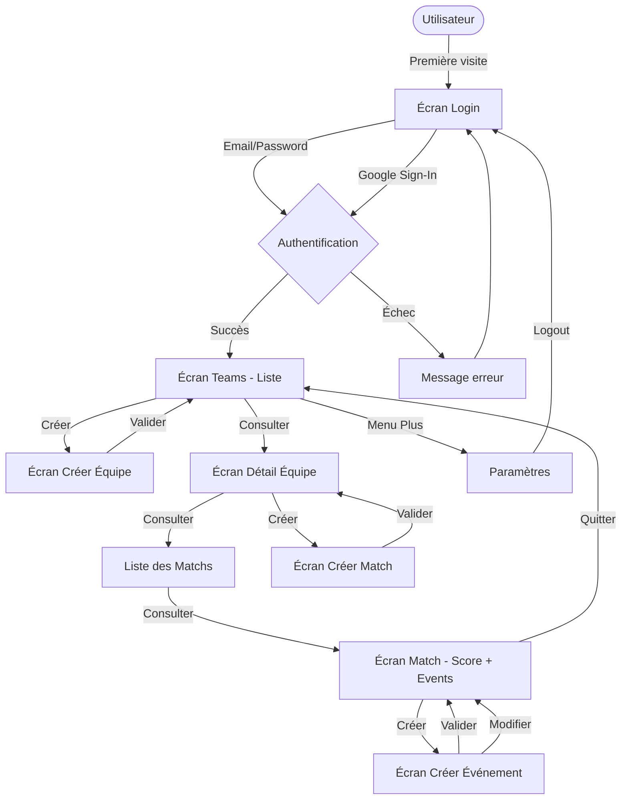
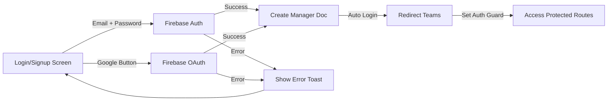
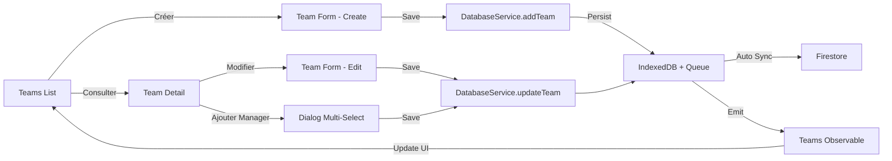
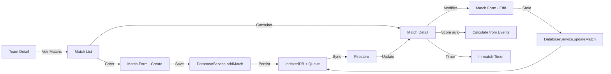
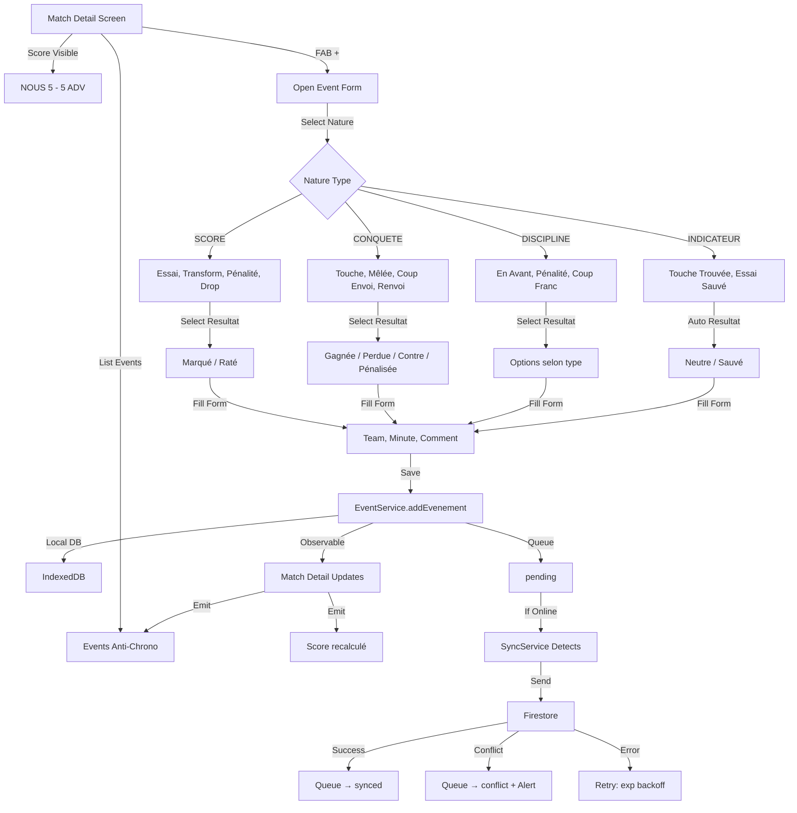
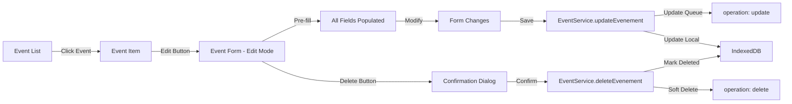
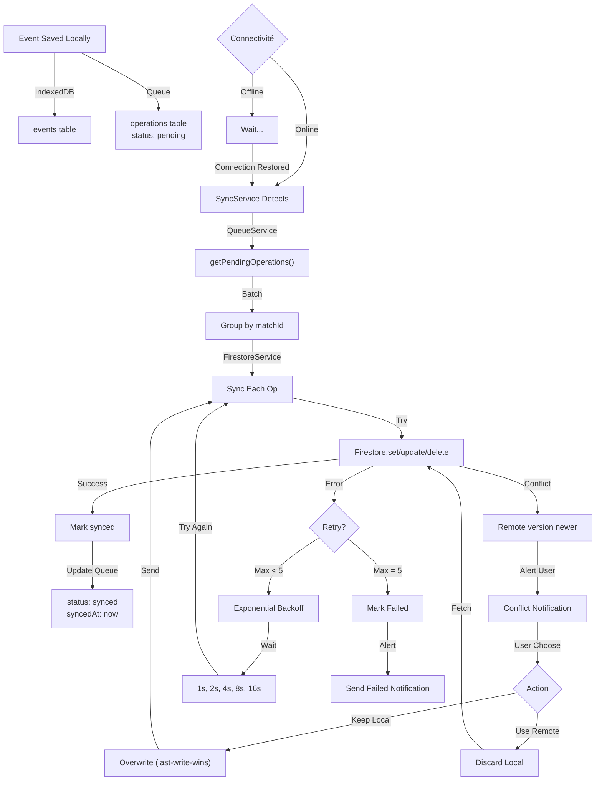
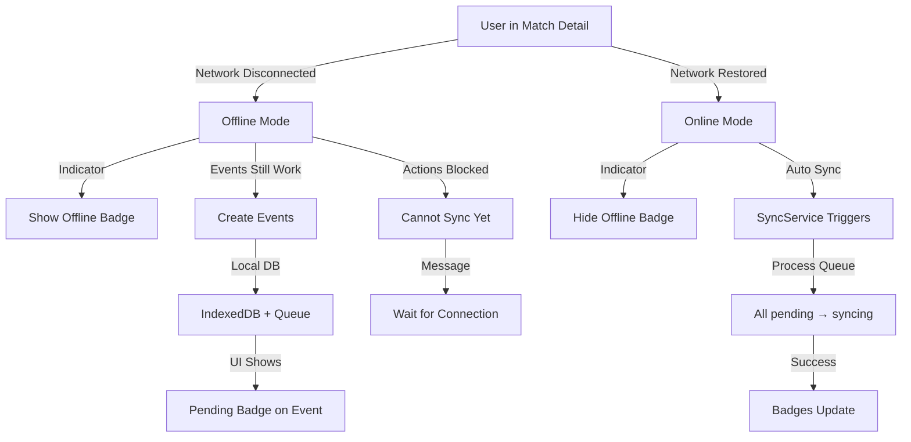
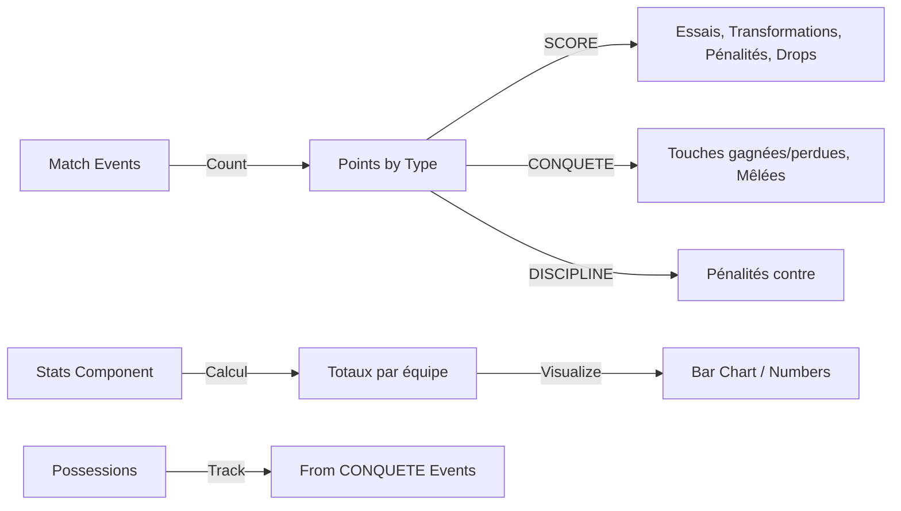

# Workflows de l'Application

## Workflow Global

## 1. Workflow Authentication

**Flux détaillé:**
1. Utilisateur arrive → Redirection vers `/auth/login`
2. Saisit email/password OU clique Google Sign-In
3. Firebase Auth vérifie les credentials
4. Si première connexion: Créer document Manager dans Firestore
5. Auth Guard autorise accès à `/app` routes
6. Redirection vers `/teams` (landing page)

## 2. Workflow Gestion d'Équipes

**Actions possibles:**
- **Créer équipe:** Nom, saison, logo
- **Modifier équipe:** Tous les champs
- **Supprimer équipe:** Avec confirmation
- **Ajouter managers:** Pour partager la gestion

## 3. Workflow Gestion des Matchs

**États du match:**
- `scheduled`: Créé mais pas commencé
- `in_progress`: En cours (chrono actif)
- `completed`: Terminé

## 4. Workflow Principal: Collecte d'Événements

**Cascade de sélection:**
1. Sélectionner **Nature** → Liste des types filtrés
2. Sélectionner **Type** → Liste des résultats valides
3. Sélectionner **Équipe** (NOUS / ADV)
4. Sélectionner **Résultat** (validé par type)
5. Remplir **Minute** (optionnel, auto si possible)
6. Ajouter **Commentaire** (optionnel)
7. **Enregistrer** → Local d'abord + Queue

## 5. Workflow Modification d'Événement

## 6. Workflow Synchronisation (Offline-first)

## 7. Workflow Mode Offline

## 8. Workflow Stats & Analytics

---

**Prochaines étapes:**
1. Implémenter chaque workflow phase par phase
2. Tester offline-first avec DevTools
3. Valider cascade de sélection d'événements
